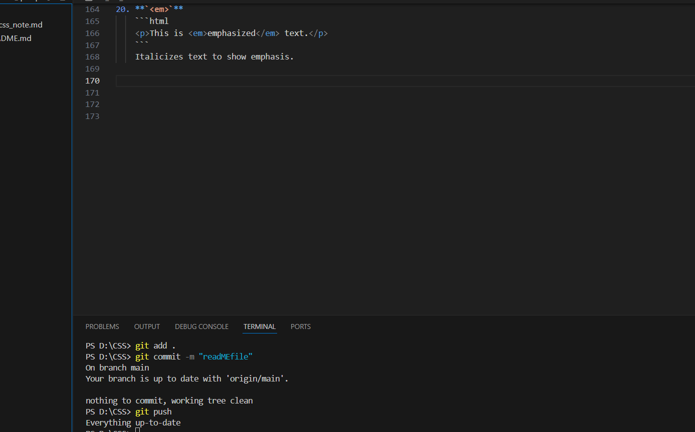

Certainly! Here are examples for each of the HTML tags along with a brief explanation:

1. **`<html>`**
   ```html
   <html>
     <!-- All content goes here -->
   </html>
   ```
   This is the root element of an HTML document.

2. **`<head>`**
   ```html
   <html>
     <head>
       <title>My Webpage</title>
     </head>
   </html>
   ```
   Contains metadata and links to stylesheets or scripts.

3. **`<title>`**
   ```html
   <head>
     <title>My Webpage Title</title>
   </head>
   ```
   Sets the title shown on the browser tab.

4. **`<body>`**
   ```html
   <body>
     <p>This is the content of the page.</p>
   </body>
   ```
   Contains all visible page content.

5. **`<h1>` to `<h6>`**
   ```html
   <h1>Main Heading</h1>
   <h2>Sub Heading</h2>
   <h3>Another Sub Heading</h3>
   ```
   These tags create headings with `<h1>` being the largest.

6. **`<p>`**
   ```html
   <p>This is a paragraph of text.</p>
   ```
   Defines a paragraph.

7. **`<a>`**
   ```html
   <a href="https://www.example.com">Visit Example</a>
   ```
   Creates a hyperlink to another page or website.

8. **``**
   ```html
   
   ```
   Embeds an image with `src` for the path and `alt` for alternative text.

9. **`<ul>` and `<ol>`**
   ```html
   <ul>
     <li>Item 1</li>
     <li>Item 2</li>
   </ul>

   <ol>
     <li>First</li>
     <li>Second</li>
   </ol>
   ```
   `<ul>` creates an unordered list (bullets) and `<ol>` an ordered list (numbers).

10. **`<li>`**
    ```html
    <ul>
      <li>List item 1</li>
      <li>List item 2</li>
    </ul>
    ```
    Represents an item in a list.

11. **`<div>`**
    ```html
    <div>
      <h2>Section Title</h2>
      <p>This is some content in a div.</p>
    </div>
    ```
    A block-level container used for grouping and styling content.

12. **`<span>`**
    ```html
    <p>This is a <span style="color: red;">highlighted</span> word.</p>
    ```
    An inline container for styling parts of text.

13. **`<form>`**
    ```html
    <form action="/submit" method="POST">
      <input type="text" name="username">
      <input type="submit" value="Submit">
    </form>
    ```
    Creates a form for user input.

14. **`<input>`**
    ```html
    <input type="text" placeholder="Enter your name">
    ```
    Represents an input field within a form.

15. **`<button>`**
    ```html
    <button>Click Me</button>
    ```
    Creates a clickable button.

16. **`<table>`**
    ```html
    <table>
      <tr>
        <th>Name</th>
        <th>Age</th>
      </tr>
      <tr>
        <td>Alice</td>
        <td>30</td>
      </tr>
    </table>
    ```
    Creates a table structure.

17. **`<tr>`, `<th>`, `<td>`**
    ```html
    <table>
      <tr>
        <th>Column 1</th>
        <th>Column 2</th>
      </tr>
      <tr>
        <td>Data 1</td>
        <td>Data 2</td>
      </tr>
    </table>
    ```
    `<tr>` is a table row, `<th>` is a header cell, and `<td>` is a data cell.

18. **`<br>`**
    ```html
    <p>This is a line break.<br>Here’s the next line.</p>
    ```
    Inserts a line break within text.

19. **`<strong>`**
    ```html
    <p>This is <strong>important</strong> text.</p>
    ```
    Makes text bold and indicates importance.

20. **`<em>`**
    ```html
    <p>This is <em>emphasized</em> text.</p>
    ```
    Italicizes text to show emphasis.




